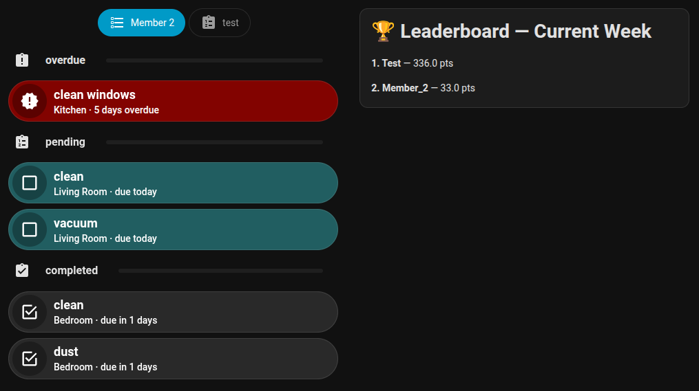

<a href="https://my.home-assistant.io/redirect/hacs_repository/?owner=hoechstleistungshaartrockner&repository=simplechores&category=integration" target="_blank" rel="noreferrer noopener"></a>

# Home Assistant Simple Chores
A Home Assistant integration to manage and track household chores. It allows you to create chores, assign them to family members, set due dates.

## Features
- Create and manage chores with due dates, custom recurrency and assigned members.
- Track chore completion status (pending, completed, overdue).
- Assign Points to chores to balance workload among family members.
- Flexible dashboard configuration using decluttering-card and auto-entities card.

## Support Development
If you find this integration useful and want to support its development, please consider fueling me with a coffee! Your support helps me dedicate more time to improving the integration and adding new features. Thank you!
<a href="https://www.buymeacoffee.com/haartrockner" target="_blank"></a>


## Installation

### via HACS
1. Open Home Assistant and go to HACS.
2. Click the three-dot menu in the top right.
3. Select "Custom repositories".
4. In the "Repository" field, paste the URL of this repository (https://github.com/hoechstleistungshaartrockner/simplechores).
5. For "Category", select "Integration".
6. Click "Add".
7. in HACS, search for "Simple Chores", and click "Download".
8. Go to "Configuration" → "Integrations" in Home Assistant.
9. Click the "+" button to add a new integration.
10. Search for "Simple Chores" and follow the prompts to set it up.
11. To add your first chore, click on the gear icon of the integration in the "Integrations" page, and click "Manage Chores". From there, you can create and manage your chores.


## Created Devices and Entities
In this integration, "Members" and "Chores" are the two main concepts. For both of these, the integration creates a device and multiple entities to represent their state.
Here's a breakdown of the created entities and their attributes for both Members and Chores:

### Member Entities

Member names are sanitized (lowercased, spaces replaced with underscores) for use in entity IDs. For example, a member named "John Doe" would have entity IDs like `sensor.john_doe_points_earned_today`.

**Points Tracking Sensors** (tracks points earned from completed chores):
- `sensor.{member_name}_points_earned_today`
  - State: numeric value, total points earned today
  - Unit: configurable points label (default: "points")
  - Attributes:
    - `integration`: "simplechores"
    - `device_id`: Home Assistant device ID for the member device

- `sensor.{member_name}_points_earned_this_week`
  - State: numeric value, total points earned this week (starting Monday)
  - Unit: configurable points label (default: "points")
  - Attributes:
    - `integration`: "simplechores"
    - `device_id`: Home Assistant device ID for the member device

- `sensor.{member_name}_points_earned_this_month`
  - State: numeric value, total points earned this month
  - Unit: configurable points label (default: "points")
  - Attributes:
    - `integration`: "simplechores"
    - `device_id`: Home Assistant device ID for the member device

- `sensor.{member_name}_points_earned_this_year`
  - State: numeric value, total points earned this year
  - Unit: configurable points label (default: "points")
  - Attributes:
    - `integration`: "simplechores"
    - `device_id`: Home Assistant device ID for the member device

**Chore Completion Tracking Sensors** (tracks number of chores completed):
- `sensor.{member_name}_chores_completed_today`
  - State: numeric value, number of chores completed today
  - Unit: "chores"
  - Attributes:
    - `integration`: "simplechores"
    - `device_id`: Home Assistant device ID for the member device

- `sensor.{member_name}_chores_completed_this_week`
  - State: numeric value, number of chores completed this week
  - Unit: "chores"
  - Attributes:
    - `integration`: "simplechores"
    - `device_id`: Home Assistant device ID for the member device

- `sensor.{member_name}_chores_completed_this_month`
  - State: numeric value, number of chores completed this month
  - Unit: "chores"
  - Attributes:
    - `integration`: "simplechores"
    - `device_id`: Home Assistant device ID for the member device

- `sensor.{member_name}_chores_completed_this_year`
  - State: numeric value, number of chores completed this year
  - Unit: "chores"
  - Attributes:
    - `integration`: "simplechores"
    - `device_id`: Home Assistant device ID for the member device

**Status Sensors** (current state):
- `sensor.{member_name}_chores_pending`
  - State: numeric value, number of pending chores currently assigned to member
  - Unit: "chores"
  - Attributes:
    - `integration`: "simplechores"
    - `device_id`: Home Assistant device ID for the member device

- `sensor.{member_name}_chores_overdue`
  - State: numeric value, number of overdue chores currently assigned to member
  - Unit: "chores"
  - Attributes:
    - `integration`: "simplechores"
    - `device_id`: Home Assistant device ID for the member device

- `sensor.{member_name}_assigned_chore_entities`
  - State: numeric value, total count of chores assigned to member
  - Attributes:
    - `integration`: "simplechores"
    - `device_id`: Home Assistant device ID for the member device
    - `entity_ids`: list of status entity IDs for all chores assigned to this member (useful for automations and dashboard filtering)

### Chore Entities

Each chore is assigned a unique `chore_id` in the format `{sanitized_chore_name}_{timestamp}` (e.g., `take_out_trash_1707685200`). All entity IDs for a chore use this chore_id as their base.

- `select.{chore_id}_status`
  - State: "pending", "completed", or "overdue"
  - Attributes:
    - `integration`: "simplechores"
    - `device_id`: Home Assistant device ID for the chore device
    - `chore_id`: unique identifier for the chore
    - `chore_name`: display name of the chore
    - `assigned_to`: member name the chore is assigned to (if any)
    - `due_date`: ISO date string of next due date
    - `due_in_days`: number of days until due (can be negative if overdue)
    - `area_id`: Home Assistant area ID (UUID) if chore is assigned to an area
    - `area_name`: human-readable area name (e.g., "Living Room") if chore is assigned to an area
    - `related_entities`: dictionary of related entity IDs for this chore

- `select.{chore_id}_assigned_to`
  - State: name of the member assigned to the chore
  - Attributes:
    - `integration`: "simplechores"
    - `device_id`: Home Assistant device ID for the chore device
    - `chore_id`: unique identifier for the chore
    - `chore_name`: display name of the chore
    - `related_entities`: dictionary of related entity IDs for this chore

- `select.{chore_id}_mark_completed_by`
  - State: null (this is an action trigger entity)
  - Purpose: Select a member to mark the chore as completed by that member (awards points and updates counters)
  - Attributes:
    - `integration`: "simplechores"
    - `device_id`: Home Assistant device ID for the chore device
    - `chore_id`: unique identifier for the chore
    - `chore_name`: display name of the chore
    - `related_entities`: dictionary of related entity IDs for this chore

- `number.{chore_id}_points`
  - State: numeric value representing points awarded for completing this chore
  - Attributes:
    - `integration`: "simplechores"
    - `device_id`: Home Assistant device ID for the chore device
    - `chore_id`: unique identifier for the chore
    - `chore_name`: display name of the chore
    - `related_entities`: dictionary of related entity IDs for this chore

- `date.{chore_id}_due_date`
  - State: date value of next due date (user-adjustable)
  - Purpose: Allows users to manually set/adjust the next due date for the chore
  - Attributes:
    - `integration`: "simplechores"
    - `device_id`: Home Assistant device ID for the chore device
    - `chore_id`: unique identifier for the chore
    - `chore_name`: display name of the chore
    - `recurrence_pattern`: pattern for chore recurrence (e.g., "daily", "weekly")
    - `recurrence_interval`: interval for recurrence (numeric)
    - `last_completed`: ISO date string of when chore was last completed
    - `due_in_days`: number of days until due (can be negative if overdue)
    - `status`: current status (pending/completed/overdue)
    - `assigned_to`: member name the chore is assigned to (if any)
    - `related_entities`: dictionary of related entity IDs for this chore

## Example Dashboard Configuration



This code snippet demonstrates how to create a chore dashboard using the decluttering-card and auto-entities card. It organizes chores into sections based on their state (overdue, pending, completed) and allows users to toggle chore states directly from the dashboard.
**You need to adjust this code to fit your specific needs**. I guess the minimum would be to change the user variable (look out for 'user: test' and 'user: Member 2')

To make this work, you need to install the following HACS plugins:

- decluttering-card
- auto-entities
- bubble-card
- simple-tabs
- button-card

```yaml
navbar-templates:
  custom1:
    layout:
      auto_padding:
        enabled: true
        desktop_px: 100
        mobile_px: 180
    desktop:
      position: left
      min_width: 768
      show_labels: true
    mobile:
      show_labels: true
    routes:
      - icon: mdi:home
        label: Home
        url: /dashboard-chores/home
      - icon: mdi:sofa
        label: Räume
        url: /rooms-dashboard2/raume2
      - icon: mdi:lightning-bolt
        label: Energie
        url: /energy
      - icon: mdi:shield
        label: Sicherheit
        url: /security
      - icon: mdi:checkbox-marked-outline
        label: To Do
        url: /dashboard-chores/chores
        tap_action:
          action: navigate
          navigation_path: /dashboard-chores/{{ chores?tab=chores_tab_test }}
        badge:
          show: |
            [[[
                return (parseInt(states['sensor.' + hass.user.name + '_chores_pending'].state) + parseInt(states['sensor.test_chores_overdue'].state)) > 0;
            ]]]
          color: |
            [[[
              if (parseInt(states['sensor.' + hass.user.name + '_chores_overdue'].state) > 0) {
                return "red";
              } else {
                return "yellow";
              };
            ]]]
          count: |
            [[[ 
                return (parseInt(states['sensor.' + hass.user.name + '_chores_pending'].state) + parseInt(states['sensor.' + hass.user.name + '_chores_overdue'].state));
            ]]]
decluttering_templates:
  simplechores_filtering_options:
    card:
      type: vertical-stack
      cards:
        - type: custom:bubble-card
          card_type: separator
          icon: mdi:account
          name: Filter by assigned User
        - type: grid
          columns: 2
          square: false
          cards:
            - type: custom:bubble-card
              card_type: button
              entity: 'switch.[[user]]_dashboard_user_filter_test'
              name: Test
            - type: custom:bubble-card
              card_type: button
              entity: 'switch.[[user]]_dashboard_user_filter_member_1'
              name: Member 1
            - type: custom:bubble-card
              card_type: button
              entity: 'switch.[[user]]_dashboard_user_filter_member_2'
              name: Member 2
            - type: custom:bubble-card
              card_type: button
              entity: 'switch.[[user]]_dashboard_user_filter_horst'
              name: Horst
        - type: custom:bubble-card
          card_type: separator
          icon: mdi:exclamation-thick
          name: Filter by Status
        - type: grid
          columns: 3
          square: false
          cards:
            - type: custom:bubble-card
              card_type: button
              entity: 'switch.[[user]]_dashboard_state_filter_pending'
              name: pending
            - type: custom:bubble-card
              card_type: button
              entity: 'switch.[[user]]_dashboard_state_filter_overdue'
              name: overdue
            - type: custom:bubble-card
              card_type: button
              entity: 'switch.[[user]]_dashboard_state_filter_completed'
              name: completed
        - type: custom:bubble-card
          card_type: separator
          icon: mdi:sort
          name: Sort by
        - type: custom:decluttering-card
          template: sorting_buttons
          variables:
            - user: '[[user]]'
  simplechores_list:
    card:
      type: custom:auto-entities
      card:
        type: grid
        square: false
        columns: 1
      card_param: cards
      else:
        type: markdown
        content: no chores to display.
      filter:
        template: >
          

          {# USER FILTER PREFIX #} 

          {# STATUS FILTER SWITCHES #}   

          {# SORT PRIORITY ENTITIES #}    {# NAMESPACE FOR
          LIST OPERATIONS #} 

          {# COLLECT MATCHING CHORES #} 

            {# --- USER FILTER LOGIC --- #}
            
            
            
            

            

            
              
            

            
              
            

            {# --- STATUS FILTER LOGIC --- #}
            
            

            
              
            
            
              
            
            
              
            

            
              
            

            {# --- RAW VALUES --- #}
            
            
            

            {# BUILD ASPECT LIST WITH PRIORITY + VALUE #}
            
            

            {# SORT ASPECTS BY PRIORITY (1 = first, 2 = second, ...) #}
            

            {# BUILD SORT TUPLE IN PRIORITY ORDER #}
            
            
              
            

            {# ADD TO LIST #}
            

          

          {# --- SORT THE LIST BY THE TUPLE --- #}  {# --- OUTPUT FINAL JSON --- #} [ 
            {{ {
              'entity': c.entity,
              'type': 'custom:decluttering-card',
              'template': 'chore_button2',
              'variables': [{'entity': c.entity}]
            } }},
           ]
  sorting_buttons:
    card:
      type: vertical-stack
      cards:
        - type: custom:decluttering-card
          template: sorting_button
          variables:
            - entity: number.[[user]]_sort_priority_area
            - name: Area Priority
        - type: custom:decluttering-card
          template: sorting_button
          variables:
            - entity: number.[[user]]_sort_priority_due_date
            - name: Due Date Priority
        - type: custom:decluttering-card
          template: sorting_button
          variables:
            - entity: number.[[user]]_sort_priority_name
            - name: Name Priority
  sorting_button:
    card:
      type: custom:bubble-card
      card_type: button
      button_type: name
      entity: '[[entity]]'
      name: '[[name]]'
      sub_button:
        main:
          - entity: '[[entity]]'
            sub_button_type: default
            icon: mdi:arrow-down-bold
            tap_action:
              action: perform-action
              perform_action: simplechores.decrease_sort_priority
              target: {}
              data:
                entity_id: '[[entity]]'
          - state_background: false
            entity: '[[entity]]'
            show_state: true
            show_icon: false
            show_background: false
            force_icon: false
          - entity: '[[entity]]'
            icon: mdi:arrow-up-bold
            state_background: true
            show_background: true
            tap_action:
              action: perform-action
              perform_action: simplechores.increase_sort_priority
              target: {}
              data:
                entity_id: '[[entity]]'
        bottom: []
  chore_button2:
    card:
      type: custom:button-card
      entity: '[[entity]]'
      name: >
        [[[  const full = entity.attributes.friendly_name || entity.entity_id;
        const parts = full.split(" "); parts.pop(); return '<marquee
        behavior="alternate" scrollamount=1>' + parts.join(" ") + '</marquee>'
        ]]]
      icon: |
        [[[
          if (entity.state === 'completed') return 'mdi:checkbox-marked-outline';
          if (entity.state === 'pending') return 'mdi:checkbox-blank-outline';
          if (entity.state === 'overdue') return 'mdi:alert-decagram';
          return 'mdi:help-circle-outline';
        ]]]
      show_icon: true
      show_name: true
      styles:
        card:
          - padding: 3px 5px
          - background: |
              [[[
                if (entity.state === 'pending') return "#215E61";
                if (entity.state === 'overdue') return "#820300";
                return "rgba(255, 255, 255, 0.1)";
              ]]]
          - border-radius: 30px
          - height: 60px
          - display: flex
          - align-items: center
        grid:
          - grid-template-areas: '"i n" "i info"'
          - grid-template-columns: min-content 1fr
          - grid-template-rows: auto auto
          - align-items: center
        img_cell:
          - width: 50px
          - height: 50px
          - border-radius: 50%
          - justify-self: center
          - align-self: center
          - background: rgba(0, 0, 0, 0.3)
        icon:
          - width: 28px
          - height: 28px
          - color: white
        name:
          - grid-area: 'n'
          - justify-self: start
          - align-self: end
          - font-size: 18px
          - font-weight: 600
          - padding-left: 10px
          - color: white
        custom_fields:
          info:
            - grid-area: info
            - justify-self: start
            - align-self: start
            - padding-left: 10px
            - font-size: 14px
            - font-weight: 500
            - color: white
      custom_fields:
        info: |
          [[[
            const area = entity.attributes.area_name || "";
            const rel = entity.attributes.related_entities || {};

            const days = entity.attributes.due_in_days;

            let extra = "";

            if (entity.state === "pending") {
              extra = "due today";
            }
            else if (entity.state === "completed") {
              if (days !== undefined) extra = `due in ${days} days`;
            }
            else if (entity.state === "overdue") {
              const overdue = -days;
              extra = `${overdue} days overdue`;
            }

            if (area && extra) return `${area} · ${extra}`;
            if (area) return area;
            return extra;
          ]]]
      tap_action:
        action: call-service
        service: simplechores.toggle_chore
        service_data:
          member: |
            [[[
              return hass.user.name;
            ]]]
          entity_id: '[[entity]]'
      hold_action:
        action: navigate
        navigation_path: |
          [[[
            return "/config/devices/device/" + entity.attributes.device_id;
          ]]]
views:
  - path: home
    title: Home
    type: sections
    sections:
      - type: custom:navbar-card
        template: custom1
  - path: chores
    title: chorespopup
    type: sections
    sections:
      - type: grid
        cards:
          - type: custom:simple-tabs
            alignment: end
            tabs:
              - title: Tasks
                icon: mdi:checkbox-marked-outline
                id: tab1
                card:
                  type: custom:decluttering-card
                  template: simplechores_list
                  variables:
                    - user: test
              - icon: mdi:cog
                id: tab2
                card:
                  type: custom:decluttering-card
                  template: simplechores_filtering_options
                  variables:
                    - user: test
              - icon: mdi:star
                card:
                  type: vertical-stack
                  cards:
                    - type: markdown
                      content: >
                        

                        


                        {# Use a namespace so we can mutate inside the loop
                        #}

                        


                        {# Collect entities with numeric value #}

                        
                          
                        


                        {# Sort by numeric value descending #}

                        


                        # 🏆 Leaderboard — Current Week


                        
                          
                          
                          **{{ loop.index }}. {{ member | capitalize }}** — {{ item.value }} {{ unit }}
                        
                    - chart_type: bar
                      period: week
                      type: statistics-graph
                      entities:
                        - sensor.test_points_earned_this_week
                        - sensor.horst_points_earned_this_week
                        - sensor.member_1_points_earned_this_week
                        - sensor.member_2_points_earned_this_week
                      stat_types:
                        - state
                      days_to_show: 90
                      hide_legend: false
                      logarithmic_scale: false
                      expand_legend: false

```